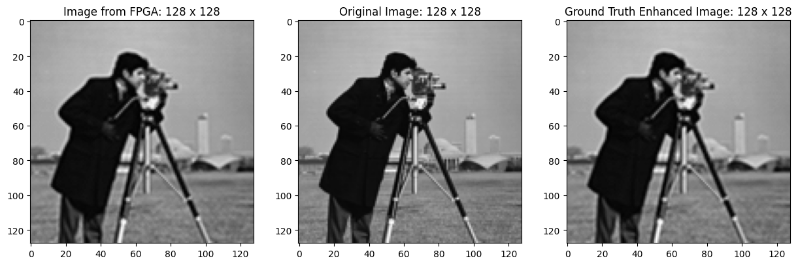

# Image-Processing-Toolkit-IPT1

**ES 204: Digital Systems (Spring 2024) Course Project**  
**Instructor:** Prof. Joycee Mekie 
**Project Supervisor:** Ruchit Chudasama 

**Project Topic:** Image Processing Toolbox 

Team: 
- $^{†}$ Abhinav Goud (22110010) 
- Aditya Mehta (22110017) 
- $^{†}$ Hrriday Ruparel (22110099) 
- Sujal Patel (22110261)
  
† - _Main contributors_

