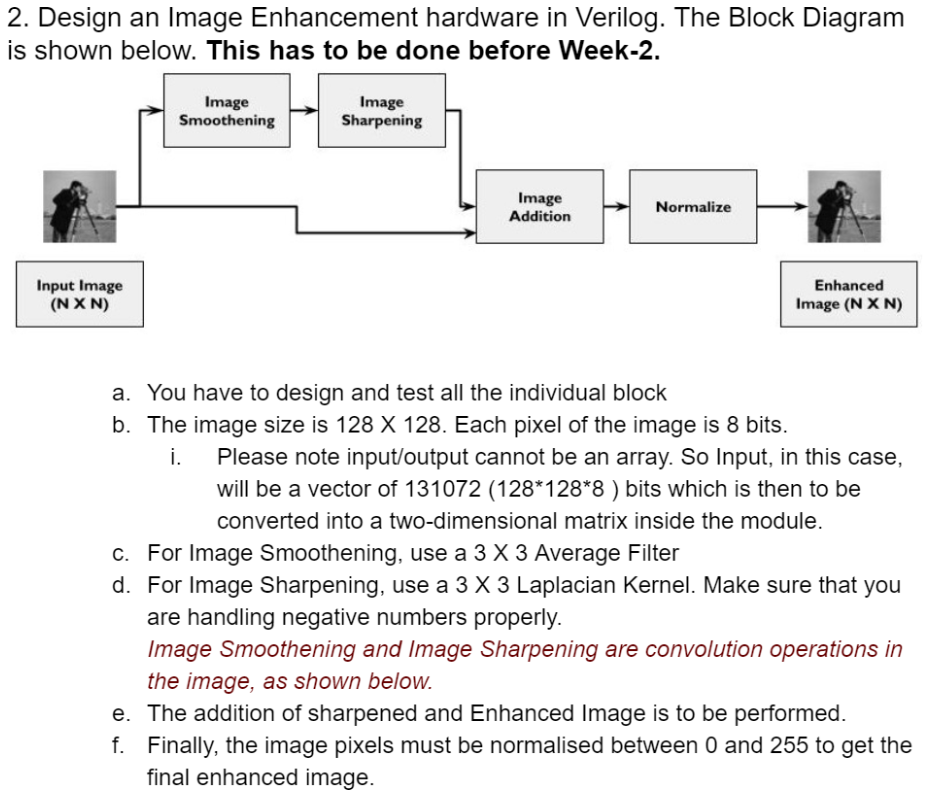

# Week 2 Task

Implement an end-to-end Basys3 FPGA Pipeline for building an Image Processing Toolkit, with special focus on Image Enhancement on 128 x 128 grayscale image as shown in the block diagram below. 

## Important Files:
- Verilog Codes (topmodule.v, imrx.v, padder.v, conv.v, pad2.v, conv2.v, imadd.v, imtx.v)
- Constraint File (c4.xdc)
- Bitstream File (HolyGrail.bit)
- Python Wrapper (IPT_python_wrapper.py)
- Week 2 Report explaining the task and codes
- [Week 2 Task Demonstration Video](https://drive.google.com/file/d/1i-r7X0kJSB9Mibeq6efwSI7RElYPJJvN/view?usp=sharing##)

## References:
- [Image Kernels Explained Visually](https://setosa.io/ev/image-kernels/)
- [Kernel (image processing) - Wikipedia](https://en.wikipedia.org/wiki/Kernel_(image_processing))
- [UART Communication on Basys 3, FPGA Dev Board Powered by Xilinx Artix 7 Part I](https://www.instructables.com/UART-Communication-on-Basys-3-FPGA-Dev-Board-Power/)
- [UART Communication on Basys 3, FPGA Dev Board Powered by Xilinx Artix 7 Part II](https://www.instructables.com/UART-Communication-on-Basys-3-FPGA-Dev-Board-Power-1/)
- [Shubhayu Das - UART RX and TX cores](https://github.com/Shubhayu-Das/UART-basys3)
- [#15 Part 1: UART-TxD Serial Communication using an FPGA Board | Verilog ➟ Step-by-Step Instructions](https://www.youtube.com/watch?v=Fms2Qwkbu1g)
- [#22 Part 2: UART-RxD Serial Communication using an FPGA Board ➟ Step-by-Step Instructions](https://www.youtube.com/watch?v=XpfEHPg5AxU)
